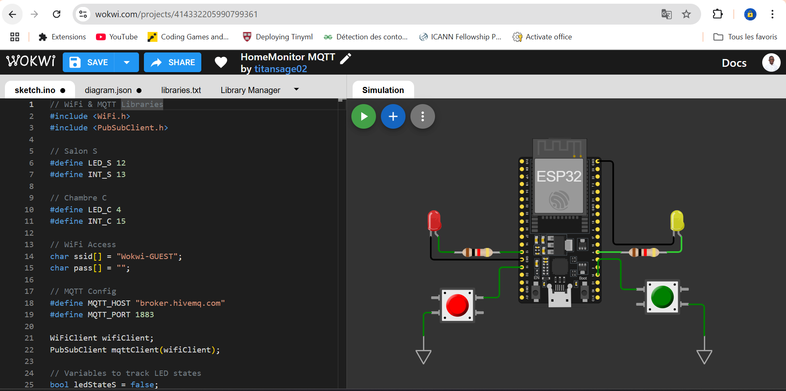

# Projet ESP32 avec MQTT et Node-RED

Ce projet connecte un **ESP32** à un serveur **MQTT** pour contrôler des LED en temps réel via des boutons-poussoirs et une interface **Node-RED**. 

Le projet comprend deux pièces : une chambre et un salon, chacune équipée d'une LED et d'un bouton-poussoir. Node-RED permet un contrôle distant des LED via un tableau de bord, et les boutons-poussoirs offrent une option de commande physique locale.

## Table des Matières
- [Aperçu](#Aperçu)
- [Fonctionnalités](#Fonctionnalités)
- [Pré-requis](#Pré-requis)
- [Installation](#Installation)
- [Configuration](#Configuration)
- [Utilisation](#Utilisation)
- [Captures d'écran](#Captures-décran)
- [À propos](#À-propos)

## Aperçu

Ce projet utilise :
- L'**ESP32** pour lire les états des boutons et contrôler les LED
- Le **protocole MQTT** pour la communication en temps réel
- **Node-RED** pour la supervision et le contrôle via un tableau de bord

Les deux espaces (chambre et salon) sont surveillés et contrôlés avec des topics MQTT spécifiques pour chaque LED et chaque interrupteur.

## Fonctionnalités

- **Contrôle en temps réel** : Chaque LED peut être contrôlée soit par un bouton-poussoir physique, soit via le tableau de bord Node-RED.
- **Synchronisation bidirectionnelle** : Les changements d'état des LED sont mis à jour en temps réel dans Node-RED.
- **Simplicité de gestion** : Grâce à MQTT et Node-RED, la gestion des topics reste flexible et extensible.

## Pré-requis

- [Wokwi](https://wokwi.com/) (pour simuler l'ESP32 en ligne, si nécessaire)
- **ESP32**
- **Broker MQTT** : [HiveMQ](http://www.hivemq.com/) (ou tout autre broker public)
- **Node-RED** : Disponible localement ou via un service cloud
- Bibliothèque **PubSubClient** pour ESP32
- Logiciel Arduino IDE (ou PlatformIO)

## Installation

1. **Cloner le dépôt GitHub** :
   ```bash
   git clone https://github.com/TitanSage02/HomeMonitor-MQTT.git
   cd HomeMonitor-MQTT
   ```

2. **Configurer l'ESP32** :
   - Installez la bibliothèque `PubSubClient` depuis le gestionnaire de bibliothèques d'**Arduino IDE** ou [ici](https://github.com/knolleary/pubsubclient).

3. **Configurer Node-RED** :
   - Créez un tableau de bord avec des interrupteurs et voyants pour les LED du salon et de la chambre.
   - Configurez les nœuds MQTT pour se connecter au broker et utiliser les topics spécifiques aux LED et aux boutons-poussoirs.

## Configuration

### ESP32

Assurez-vous de configurer votre code avec les informations correctes pour le réseau Wi-Fi et le broker MQTT. Modifiez les lignes suivantes dans le code si nécessaire :

```cpp
// WiFi Access
char ssid[] = "Votre_SSID";
char pass[] = "Votre_Mot_de_passe";

// MQTT configuration
#define MQTT_HOST "broker.hivemq.com"
#define MQTT_PORT 1883
```

### Topics MQTT

- `salon/interrupt` : État du bouton-poussoir du salon
- `chambre/interrupt` : État du bouton-poussoir de la chambre

Assurez-vous que ces topics sont bien configurés dans Node-RED et l'ESP32 pour correspondre aux actions souhaitées.

## Utilisation

- **Démarrer Node-RED** : Lancez Node-RED et ouvrez le tableau de bord pour contrôler les LED du salon et de la chambre.
- **ESP32** : Connectez l'ESP32 et vérifiez que les boutons et les LED répondent correctement aux commandes MQTT et aux actions physiques.

## Captures d'écran



## À propos

Projet conçu et maintenu par Espérance AYIWAHOUN
